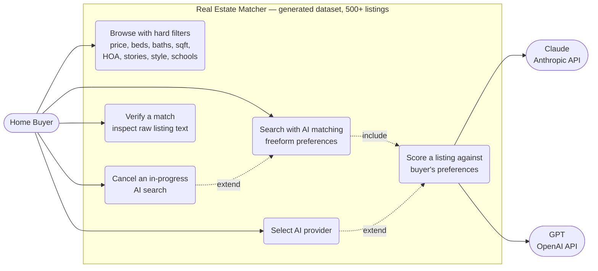
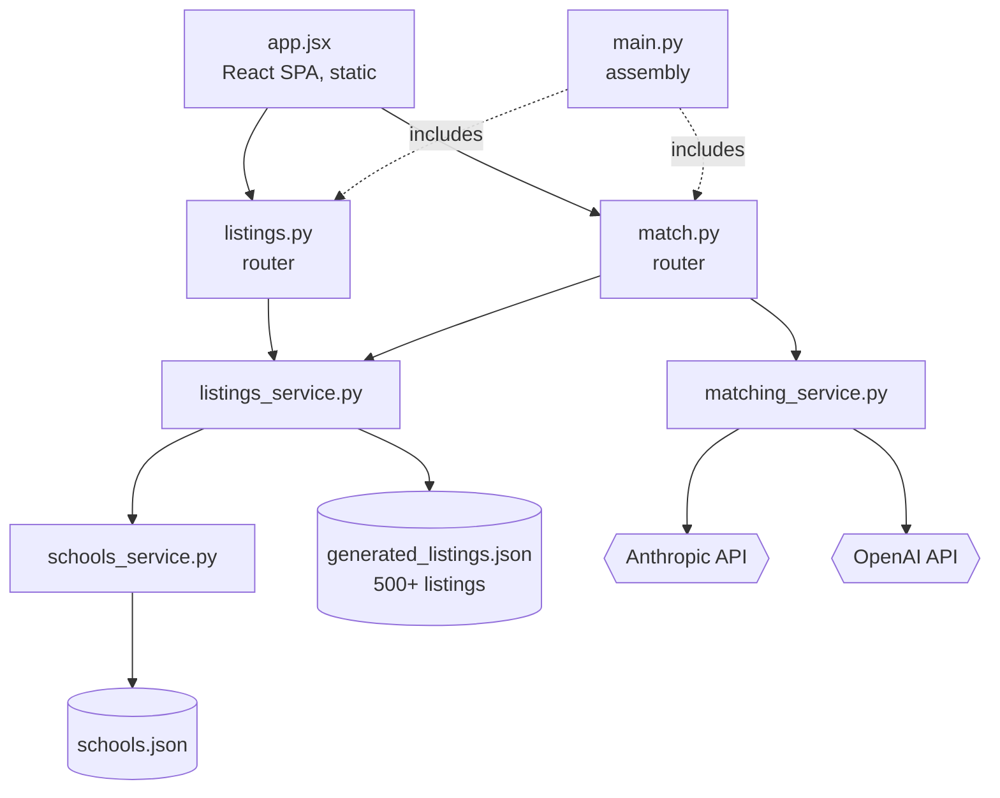
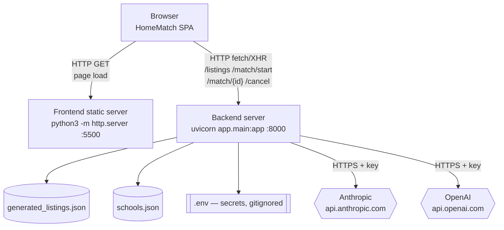
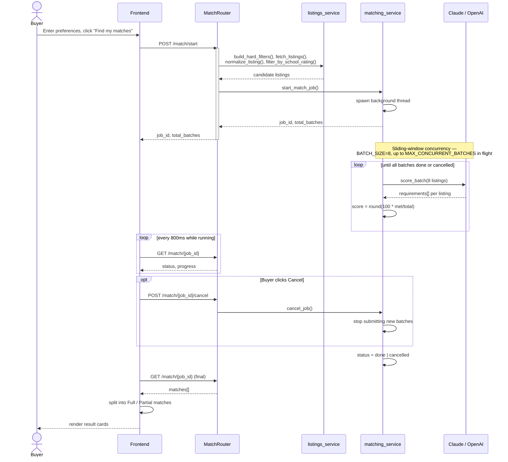

# Real Estate Matcher — Architecture Document

**Scope:** this document covers the system as it behaves against the
`generated` data source (500+ synthetic listings) specifically.

Diagrams are [Mermaid](https://mermaid.js.org) — they render natively when
this file is viewed on GitHub, GitLab, and most modern markdown viewers, no
external service, extension, or repo-visibility requirement needed.
Standalone `.mmd` source files are also in `mermaid/` if you want to drop
one into the [Mermaid Live Editor](https://mermaid.live) directly.

---

## 1. Use-Case View

**UC1 (hard-filter browsing) and UC6 (AI scoring) are structurally
separate** — no shared code path. That's what makes it a guarantee, not
just an intention, that "Browse all" never incurs AI cost or latency.

---

## 2. Logical View

**`listings.py` never imports `matching_service.py`** — a structural
guarantee that "Browse all" cannot reach an AI provider, not a runtime
check that could be bypassed. **`build_hard_filters()`** in
`listings_service.py` is shared by both routers, not duplicated.

---

## 3. Physical View

**Single process** — concurrency comes from Python threads
(`ThreadPoolExecutor`, up to `MAX_CONCURRENT_BATCHES`), not multiple
backend processes. Job state lives in an **in-memory dict**, lost on
restart — the one piece that would need to move to something shared
(Redis, a database) before running behind more than one worker process.
API keys: gitignored, never sent to the browser, never logged — only
usage counts are printed to the server terminal.

---

## 4. Sequence Diagram — AI-Matching a Search

**Score is computed by our own code**, not trusted directly from the
model's returned number — a deliberate fix after testing showed models
could state a correct-sounding reason while returning an inconsistent
score. **Cancellation is real:** it stops further batches from being
submitted; an already-in-flight API call finishes (can't be recalled).

---

## 5. Security View

```mermaid
flowchart LR
    subgraph Untrusted["Untrusted zone"]
        Browser["Browser / SPA"]
    end

    subgraph Trusted["Trusted zone — server process"]
        API["FastAPI app"]
        Validators["Pydantic validators"]
        Secrets[".env secrets"]
        Jobs["In-memory job registry"]
    end

    subgraph External["External trusted providers"]
        Anthropic{{"Anthropic API"}}
        OpenAI{{"OpenAI API"}}
    end

    Browser -->|HTTP| API
    API --> Validators
    API --> Secrets
    API --> Jobs
    API -->|"HTTPS + key"| Anthropic
    API -->|"HTTPS + key"| OpenAI

    style Untrusted fill:#2a0f0f,stroke:#CC0000,stroke-width:2px
    style Trusted fill:#0f2412,stroke:#007700,stroke-width:2px
    style External fill:#1e1e1e,stroke:#888888,stroke-width:2px
```

### Security findings, in plain writing

| # | Finding | Current state | Real risk if deployed publicly, unaddressed |
|---|---|---|---|
| 1 | **No authentication on any endpoint** | Confirmed — zero auth code anywhere in `app/routers/` | Anyone reaching the port can trigger real AI API costs, or poll/cancel any job by guessing its UUID |
| 2 | **CORS defaults to `*`** | `CORS_ALLOW_ORIGINS` defaults to wildcard in `config.py` | Any website's JS could call this API from a visitor's browser |
| 3 | **A secret in frontend code is not a real barrier** | N/A — general principle | Anyone can view it via browser DevTools and replay requests directly, bypassing the UI entirely |
| 4 | **Secrets handling** | `.env` gitignored, never returned in responses, never logged (only usage counts) | Verified correct |
| 5 | **Input validation** | Every field validated by Pydantic (type, enum membership) | Verified correct — invalid input gets a clean 422 |
| 6 | **Data sensitivity** | Entirely synthetic — fictional addresses, fictional school names/ratings | No real PII or real-world claims at risk |

**Bottom line:** hardened at input validation and secrets handling; **zero
access control** by design, appropriate for local/small-group sharing with
a hard spend cap set on the AI provider side, not appropriate for public
deployment without adding real authentication.
