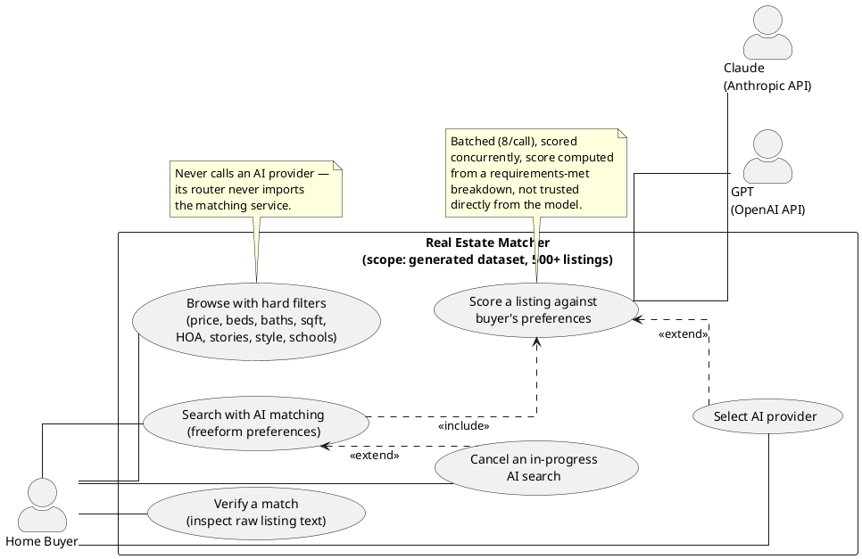
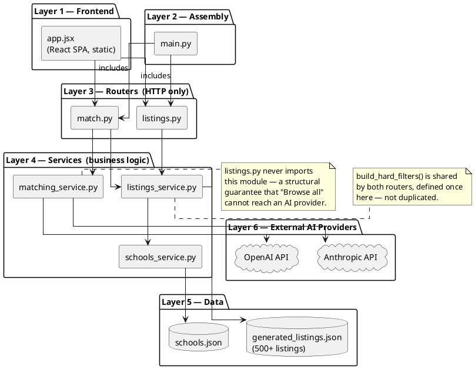
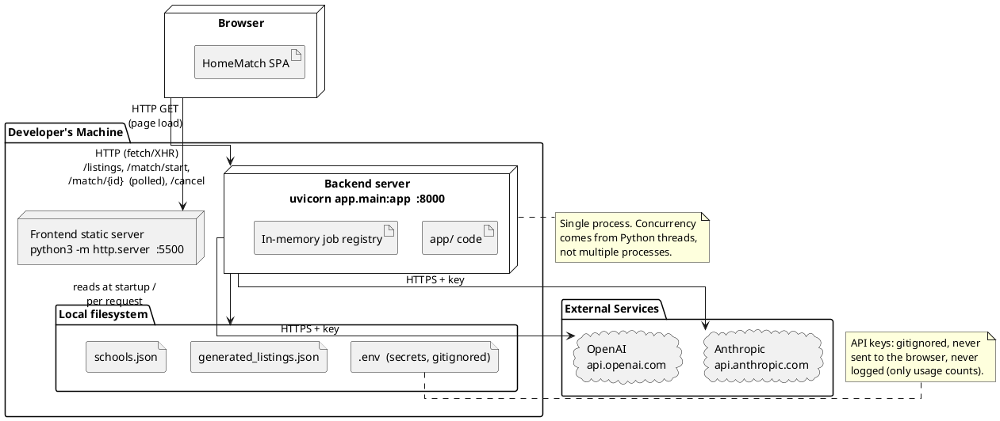
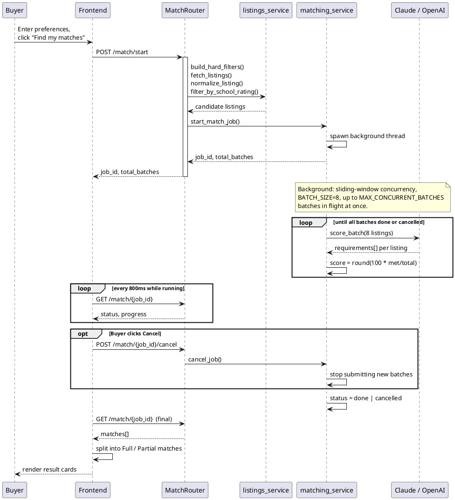
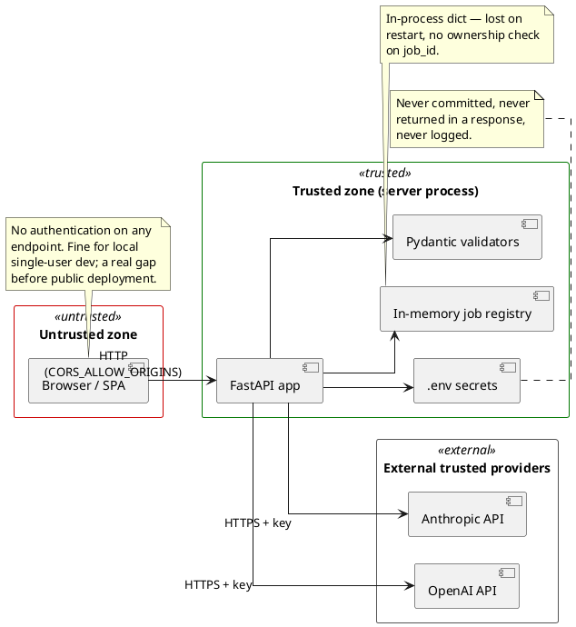

# Real Estate Matcher — Architecture Document

**Scope:** this document covers the system as it behaves against the
`generated` data source (500+ synthetic listings) specifically.

Diagrams are [PlantUML](https://plantuml.com) source, embedded below and
as standalone `.puml` files in `diagrams/`. Render at
[plantuml.com/plantuml](https://www.plantuml.com/plantuml/uml/), via the
PlantUML VS Code extension, or any local PlantUML toolchain.

---

## 1. Use-Case View

---

## 2. Logical View

Strict top-to-bottom layering — frontend, assembly, routers, services,
data, external providers — so every arrow flows one direction, no
backward or diagonal crossings.

---

## 3. Physical View

Same layering discipline — browser, dev machine services, filesystem,
external clouds, each in their own tier.

---

## 4. Sequence Diagram — AI-Matching a Search

Participants ordered strictly left-to-right in call order (Buyer → Frontend
→ Router → listings_service → matching_service → AI), so the flow reads
top-to-bottom with no backward jumps between lifelines.

**Score is computed by our own code**, not trusted directly from the
model's returned number — a deliberate fix after testing showed models
could state a correct-sounding reason while returning an inconsistent
score. **Cancellation is real:** it stops further batches from being
submitted; an already-in-flight API call finishes (can't be recalled).

---

## 5. Security View

Left-to-right zone flow: untrusted browser → trusted server process →
external trusted providers.

### Security findings, in plain writing

| # | Finding | Current state | Real risk if deployed publicly, unaddressed |
|---|---|---|---|
| 1 | **No authentication on any endpoint** | Confirmed — zero auth code anywhere in `app/routers/` | Anyone reaching the port can trigger real AI API costs, or poll/cancel any job by guessing its UUID |
| 2 | **CORS defaults to `*`** | `CORS_ALLOW_ORIGINS` defaults to wildcard in `config.py` | Any website's JS could call this API from a visitor's browser |
| 3 | **A secret in frontend code is not a real barrier** | N/A — general principle | Anyone can view it via browser DevTools and replay requests directly, bypassing the UI entirely |
| 4 | **Secrets handling** | `.env` gitignored, never returned in responses, never logged (only usage counts) | Verified correct |
| 5 | **Input validation** | Every field validated by Pydantic (type, enum membership) | Verified correct — invalid input gets a clean 422 |
| 6 | **Data sensitivity** | Entirely synthetic — fictional addresses, fictional school names/ratings | No real PII or real-world claims at risk |

**Bottom line:** hardened at input validation and secrets handling; **zero
access control** by design, appropriate for local/small-group sharing with
a hard spend cap set on the AI provider side, not appropriate for public
deployment without adding real authentication.
